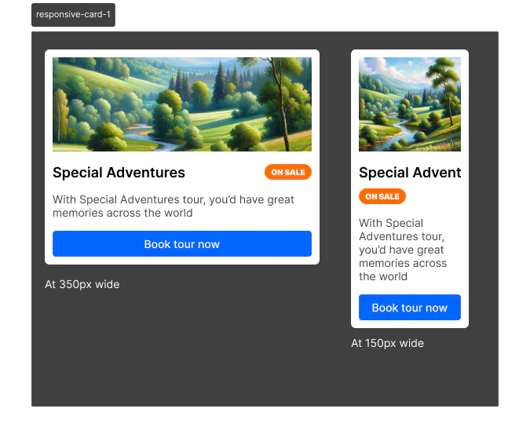

# [Responsive Card - 1 | Frontend Hire](https://www.frontendhire.com/questions/responsive-card-1)

##### 

Cards are a popular design pattern in web development. They are used to group related information in a flexible and extensible manner. 

In this challenge, you will create a responsive card using HTML and CSS.

##### 

### Requirements

1. Link for the Figma Design: [Responsive Card - 1](https://www.figma.com/file/nT3zhFaMpNLXeoRv2asrSp/Frontend-Hire?type=design&node-id=8-3&mode=design&t=aipoWxawFPKpEQuT-4)

2. Your solution should match the design as closely as possible.

3. Make sure you are using correct semantic HTML markup.

### Instructions

- Write your HTML markup in the index.html file.

- Write your CSS in the styles.css file.
  
  - Do not worry about Typography. You can use the default font.
  
  - Do not worry about the image to use. You can use any image (copy image link from any google image) of your choice.
  
  - Your solution should use classic CSS. However, if you prefer, you can opt for TailwindCSS.

###### Enabling TailwindCSS (Optional)

If you choose to use TailwindCSS, include this script in the head of your index.html file:

```html
<script src="https://cdn.tailwindcss.com"></script>
```

### Notes

1. The card should be responsive and should look good on all screen sizes.

2. Login to Figma to inspect the design otherwise you will only see the design as an image.

3. If you inspect the card properties in Figma, you will notice the use of min-width and max-width.

4. Figma has launched Dev Mode which allows you to inspect the CSS properties of any element in the design. You can also copy the CSS properties directly from Figma.

##### Design Reference

If you do not want to use Figma, you can use this image as a reference:


