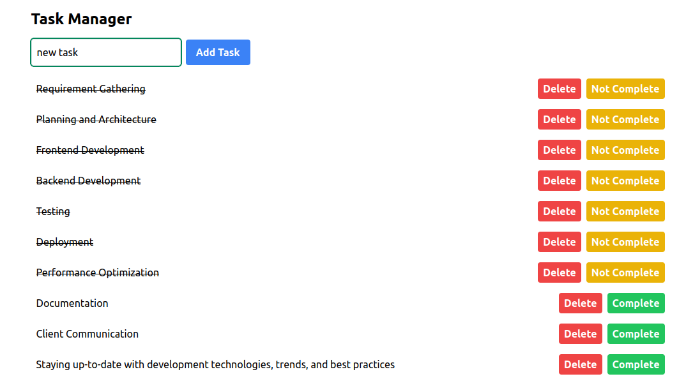

# ToDoApp


## Table of Contents

- [About](#about)
- [Demo](#demo)
- [Installation](#installation)

## About

Basic app to create,edit,modify and delete tasks that persists in localStorage.

          


## Demo



## Installation

Instructions on how to install and run your project locally. Include any prerequisites and step-by-step instructions.


```bash
git clone https://github.com/rr-tri/front-end-hire/tree/main/vite-project
cd vite-project
npm install
npm run dev
```
